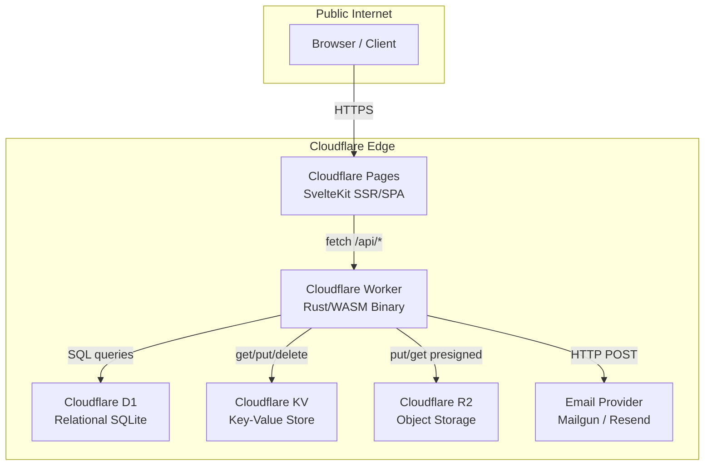
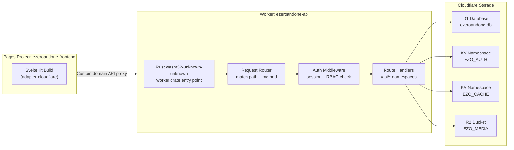
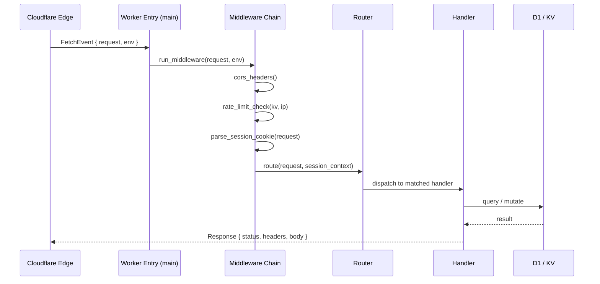
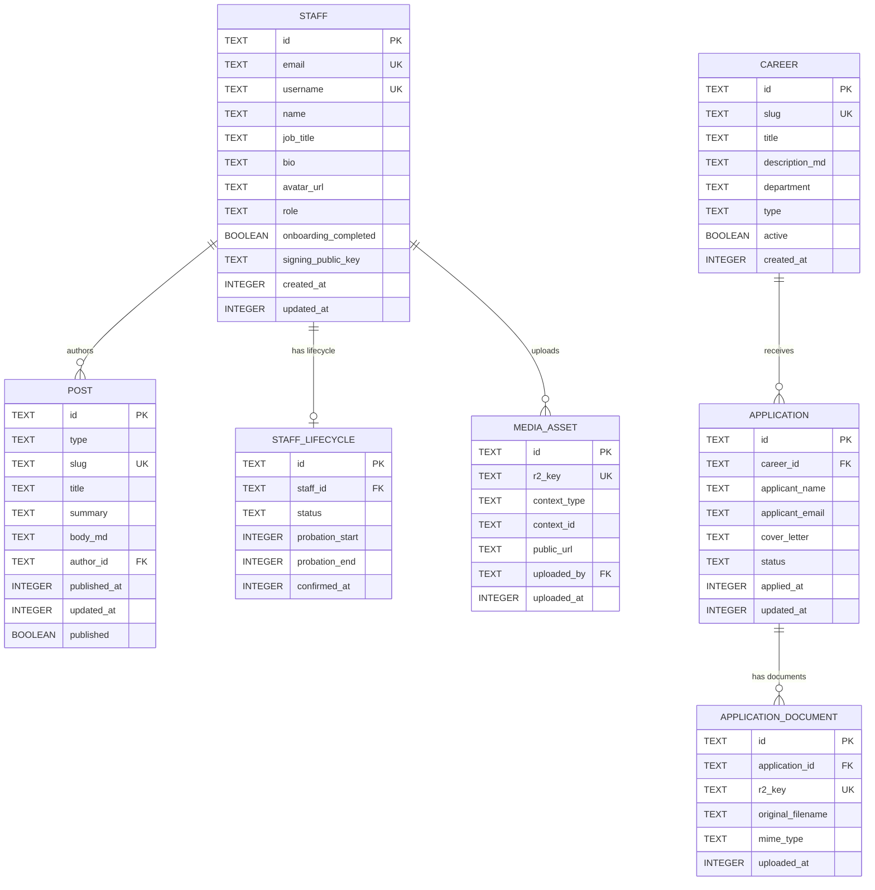
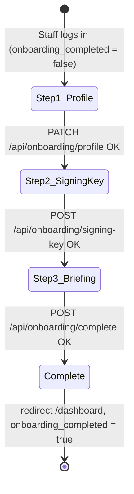
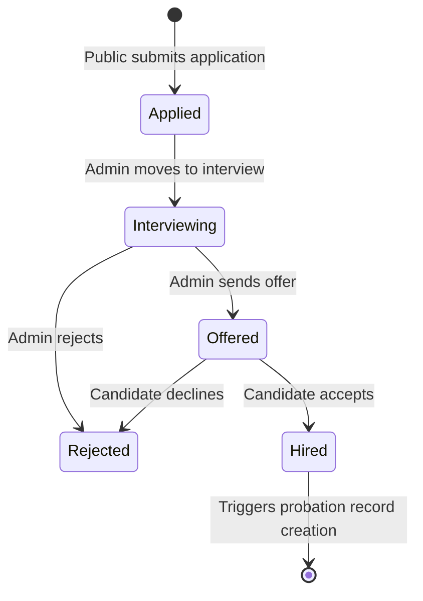
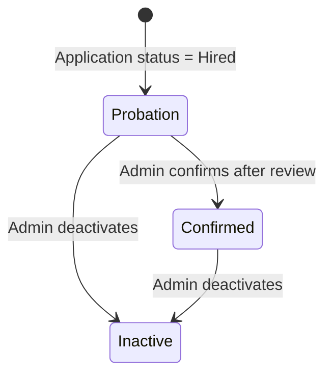
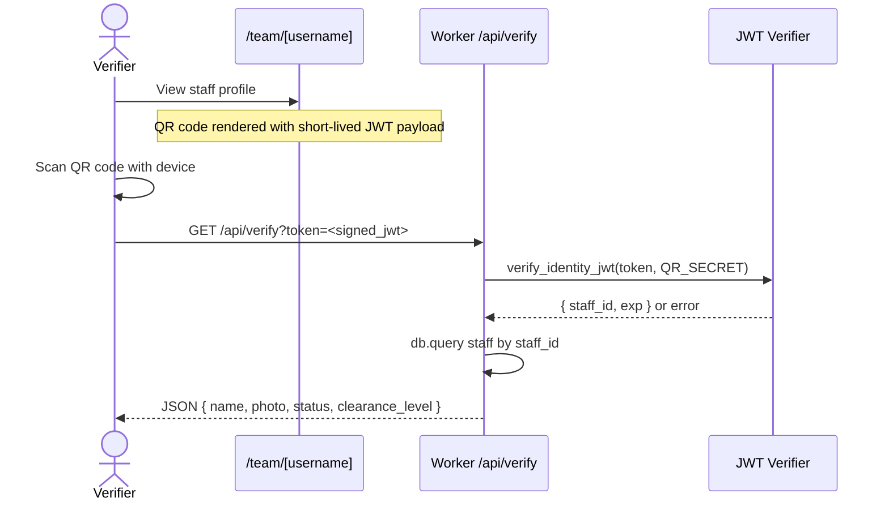
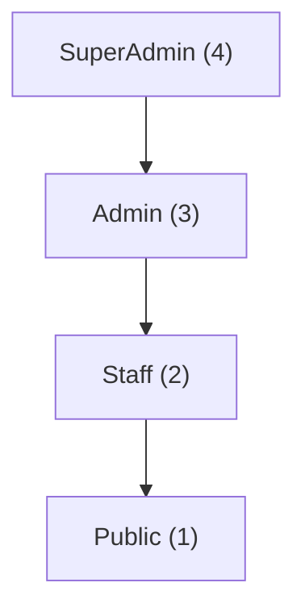

# Design Document: eZeroAndOne Core Engine

## Overview

eZeroAndOne.io is a corporate platform built on a Cloudflare-native stack: a SvelteKit frontend
deployed to Cloudflare Pages, a Rust/WebAssembly backend running on Cloudflare Workers, Cloudflare D1
for relational storage, Cloudflare KV for ephemeral auth state, and Cloudflare R2 for binary object
storage. The platform serves public-facing content (insights, work, capabilities, careers, team
profiles) while providing a fully secured, RBAC-governed staff portal with passwordless magic-link
authentication, an onboarding wizard, cryptographic identity QR codes, and a complete HR lifecycle
pipeline — all optimised for the Cloudflare Free Tier CPU and size budgets. R2 backs two storage
domains: career application documents (CVs, cover letters, portfolios) kept private behind
time-limited presigned URLs, and public website media (post cover images, staff avatars, career hero
images) served via a custom CDN domain.

The design below covers both the high-level system architecture (diagrams, component contracts,
data models) and the low-level implementation detail (algorithms, formal function specifications,
pseudocode) for every subsystem described in the specification.

---

## Table of Contents

1. High-Level Architecture
2. Cloudflare Deployment Topology
3. Frontend — SvelteKit Layer
4. Backend — Rust/WASM Worker Layer
5. Data Models (D1 Schema)
6. KV Namespaces
   - 6.5 R2 Bucket — EZO_MEDIA
7. Passwordless Magic-Link Auth
8. Staff Onboarding Wizard
9. HR Pipeline & Career Lifecycle
10. Secure Corporate Identity & QR Verification
11. RBAC & Middleware
12. API Surface
13. UI/UX Design System
14. Cloudflare Free Tier Optimisation
15. Error Handling Strategy
16. Testing Strategy
17. Security Considerations
18. Dependencies

---

## Architecture




### Component Responsibilities

| Component | Role |
|-----------|------|
| Cloudflare Pages | Serves SvelteKit routes; handles SSR for SEO-sensitive public pages |
| Cloudflare Worker (Rust/WASM) | All business logic, auth, RBAC, data access — single binary entry point |
| Cloudflare D1 | Persistent relational data: staff, content, applications, lifecycle records |
| Cloudflare KV | Magic-link tokens (TTL 15 min), session cache, rate-limit counters |
| Cloudflare R2 | Binary object storage: application documents (CV, portfolio), post cover images, staff avatars, career hero images |
| Email Provider | Transactional magic-link delivery (Mailgun REST or Resend REST) |

---

## Components and Interfaces

### Cloudflare Deployment Topology



### `wrangler.toml` Bindings (Outline)

```toml
name = "ezeroandone-api"
main = "build/worker/shim.mjs"
compatibility_date = "2025-01-01"

[[d1_databases]]
binding = "DB"
database_name = "ezeroandone-db"
database_id = "<uuid>"

[[kv_namespaces]]
binding = "EZO_AUTH"
id = "<uuid>"

[[kv_namespaces]]
binding = "EZO_CACHE"
id = "<uuid>"

[[r2_buckets]]
binding = "EZO_MEDIA"
bucket_name = "ezeroandone-media"

[build.upload]
format = "modules"
```

---

### 3. Frontend — SvelteKit Layer

### 3.1 Route Map


```
src/routes/
├── +layout.svelte               ← Root layout (theme store, nav, header)
├── +page.svelte                 ← Home / landing
├── insights/
│   ├── +page.svelte             ← Index: list of articles
│   └── [slug]/+page.svelte      ← Single article
├── work/
│   ├── +page.svelte             ← Portfolio index
│   └── [slug]/+page.svelte      ← Single project
├── capabilities/
│   ├── +page.svelte             ← Services index
│   └── [slug]/+page.svelte      ← Deep-dive single
├── team/
│   ├── +page.svelte             ← Staff directory
│   └── [username]/+page.svelte  ← Profile + QR verification widget
├── careers/
│   ├── +page.svelte             ← Job listing index
│   └── [slug]/+page.svelte      ← Job detail + application form
├── auth/
│   ├── login/+page.svelte       ← Magic-link email entry
│   └── callback/+page.svelte    ← Token exchange → session cookie
├── onboarding/
│   └── +page.svelte             ← Multi-step onboarding wizard
└── (admin)/
    ├── +layout.svelte           ← Admin shell with sidebar nav
    ├── dashboard/+page.svelte
    ├── staff/+page.svelte
    ├── careers/+page.svelte
    └── content/+page.svelte
```

### 3.2 SvelteKit Load Functions Pattern

```typescript
// src/routes/insights/[slug]/+page.server.ts
import type { PageServerLoad } from './$types';

export const load: PageServerLoad = async ({ params, fetch, cookies }) => {
  const sessionToken = cookies.get('session');
  const res = await fetch(`/api/insights/${params.slug}`, {
    headers: { Cookie: `session=${sessionToken}` }
  });
  if (!res.ok) throw error(res.status);
  const post = await res.json();
  return { post };
};
```

### 3.3 Theme Store

```typescript
// src/lib/stores/theme.ts
import { writable } from 'svelte/store';
import { browser } from '$app/environment';

type Theme = 'dark' | 'light';

const stored = browser
  ? (localStorage.getItem('ezo-theme') as Theme) ?? 'dark'
  : 'dark';

export const theme = writable<Theme>(stored);

theme.subscribe((val) => {
  if (browser) {
    localStorage.setItem('ezo-theme', val);
    document.documentElement.setAttribute('data-theme', val);
  }
});
```

### 3.4 Component Interfaces

```typescript
interface NavItem {
  label: string;
  href: string;
  active: boolean;
}

interface GlassCardProps {
  accentColor: 'red' | 'blue' | 'green' | 'yellow';
  blur?: number;       // default 16px
  saturate?: number;   // default 180
}

interface StaffProfile {
  id: string;
  username: string;
  name: string;
  jobTitle: string;
  bio: string;
  avatarUrl: string;
  role: 'SuperAdmin' | 'Admin' | 'Staff';
  status: 'Probation' | 'Confirmed';
  onboardingCompleted: boolean;
}
```

---

### 4. Backend — Rust/WASM Worker Layer

### 4.1 Worker Entry Point Architecture



### 4.2 Core Rust Module Structure


```
worker/src/
├── lib.rs                  ← #[event(fetch)] entry, middleware chain
├── router.rs               ← Path + method dispatch table
├── middleware/
│   ├── mod.rs
│   ├── cors.rs
│   ├── rate_limit.rs
│   └── auth.rs             ← Session cookie parse, RBAC check
├── handlers/
│   ├── mod.rs
│   ├── auth.rs             ← /api/auth/* (magic-link send + callback)
│   ├── content.rs          ← /api/insights, /api/work, /api/capabilities
│   ├── team.rs             ← /api/team
│   ├── careers.rs          ← /api/careers + applications
│   ├── onboarding.rs       ← /api/onboarding
│   ├── verify.rs           ← /api/verify (QR JWT check)
│   └── admin.rs            ← /api/admin/* (staff CRUD, HR actions)
├── models/
│   ├── mod.rs
│   ├── staff.rs
│   ├── content.rs
│   ├── career.rs
│   └── session.rs
├── db/
│   ├── mod.rs
│   ├── queries.rs          ← Typed D1 query helpers
│   └── migrations.rs       ← Schema migration runner
├── crypto/
│   ├── mod.rs
│   ├── token.rs            ← Magic-link token generation
│   ├── jwt.rs              ← JWT sign/verify (HS256)
│   └── signing_key.rs      ← Staff corporate key provisioning
├── storage/
│   ├── mod.rs
│   ├── r2.rs               ← R2 put/get/delete helpers + presigned URL generation
│   └── validator.rs        ← File type, size, and MIME validation
└── email/
    ├── mod.rs
    └── provider.rs         ← Mailgun / Resend HTTP client
```

### 4.3 Worker Entry Pseudocode

```pascal
PROCEDURE handle_fetch(request, env)
  INPUT: request: Request, env: Env
  OUTPUT: Response

  SEQUENCE
    // CORS preflight fast-path
    IF request.method = "OPTIONS" THEN
      RETURN cors_preflight_response()
    END IF

    // Rate limiting
    ip ← request.headers["CF-Connecting-IP"]
    allowed ← rate_limit_check(env.EZO_AUTH, ip)
    IF NOT allowed THEN
      RETURN Response { status: 429, body: "Too Many Requests" }
    END IF

    // Session context (may be None for public routes)
    session_ctx ← parse_session_cookie(request, env.JWT_SECRET)

    // Route dispatch
    response ← router_dispatch(request, session_ctx, env)

    // Attach CORS headers to all responses
    RETURN attach_cors_headers(response)
  END SEQUENCE
END PROCEDURE
```

---

## Data Models

### 5.1 Entity Relationship Diagram



### 5.2 Full DDL

```sql
CREATE TABLE staff (
  id                    TEXT PRIMARY KEY DEFAULT (lower(hex(randomblob(16)))),
  email                 TEXT NOT NULL UNIQUE,
  username              TEXT NOT NULL UNIQUE,
  name                  TEXT NOT NULL DEFAULT '',
  job_title             TEXT NOT NULL DEFAULT '',
  bio                   TEXT NOT NULL DEFAULT '',
  avatar_url            TEXT NOT NULL DEFAULT '',
  role                  TEXT NOT NULL DEFAULT 'Staff'
                          CHECK(role IN ('SuperAdmin','Admin','Staff')),
  onboarding_completed  INTEGER NOT NULL DEFAULT 0,
  signing_public_key    TEXT,
  created_at            INTEGER NOT NULL DEFAULT (unixepoch()),
  updated_at            INTEGER NOT NULL DEFAULT (unixepoch())
);

CREATE TABLE staff_lifecycle (
  id                TEXT PRIMARY KEY DEFAULT (lower(hex(randomblob(16)))),
  staff_id          TEXT NOT NULL UNIQUE REFERENCES staff(id) ON DELETE CASCADE,
  status            TEXT NOT NULL DEFAULT 'Probation'
                      CHECK(status IN ('Probation','Confirmed','Inactive')),
  probation_start   INTEGER NOT NULL DEFAULT (unixepoch()),
  probation_end     INTEGER,
  confirmed_at      INTEGER
);

CREATE TABLE post (
  id            TEXT PRIMARY KEY DEFAULT (lower(hex(randomblob(16)))),
  type          TEXT NOT NULL CHECK(type IN ('insight','work','capability')),
  slug          TEXT NOT NULL UNIQUE,
  title         TEXT NOT NULL,
  summary       TEXT NOT NULL DEFAULT '',
  body_md       TEXT NOT NULL DEFAULT '',
  author_id     TEXT REFERENCES staff(id),
  published_at  INTEGER,
  updated_at    INTEGER NOT NULL DEFAULT (unixepoch()),
  published     INTEGER NOT NULL DEFAULT 0
);

CREATE TABLE team_profile (
  id          TEXT PRIMARY KEY REFERENCES staff(id) ON DELETE CASCADE,
  linkedin    TEXT,
  github      TEXT,
  twitter     TEXT,
  skills      TEXT,
  order_rank  INTEGER NOT NULL DEFAULT 0
);

CREATE TABLE career (
  id              TEXT PRIMARY KEY DEFAULT (lower(hex(randomblob(16)))),
  slug            TEXT NOT NULL UNIQUE,
  title           TEXT NOT NULL,
  description_md  TEXT NOT NULL DEFAULT '',
  department      TEXT NOT NULL DEFAULT '',
  type            TEXT NOT NULL DEFAULT 'Full-Time'
                    CHECK(type IN ('Full-Time','Part-Time','Contract','Internship')),
  active          INTEGER NOT NULL DEFAULT 1,
  created_at      INTEGER NOT NULL DEFAULT (unixepoch())
);

CREATE TABLE application (
  id               TEXT PRIMARY KEY DEFAULT (lower(hex(randomblob(16)))),
  career_id        TEXT NOT NULL REFERENCES career(id),
  applicant_name   TEXT NOT NULL,
  applicant_email  TEXT NOT NULL,
  cover_letter     TEXT NOT NULL DEFAULT '',
  status           TEXT NOT NULL DEFAULT 'Applied'
                     CHECK(status IN ('Applied','Interviewing','Offered','Rejected','Hired')),
  applied_at       INTEGER NOT NULL DEFAULT (unixepoch()),
  updated_at       INTEGER NOT NULL DEFAULT (unixepoch())
);

-- Performance indices
CREATE INDEX idx_post_type_slug       ON post(type, slug);
CREATE INDEX idx_post_published       ON post(published, published_at DESC);
CREATE INDEX idx_application_career   ON application(career_id, status);
CREATE INDEX idx_lifecycle_status     ON staff_lifecycle(status, probation_end);

-- R2 document & media tracking
CREATE TABLE application_document (
  id                TEXT PRIMARY KEY DEFAULT (lower(hex(randomblob(16)))),
  application_id    TEXT NOT NULL REFERENCES application(id) ON DELETE CASCADE,
  r2_key            TEXT NOT NULL UNIQUE,
  original_filename TEXT NOT NULL,
  mime_type         TEXT NOT NULL,
  uploaded_at       INTEGER NOT NULL DEFAULT (unixepoch())
);

CREATE TABLE media_asset (
  id            TEXT PRIMARY KEY DEFAULT (lower(hex(randomblob(16)))),
  r2_key        TEXT NOT NULL UNIQUE,
  context_type  TEXT NOT NULL CHECK(context_type IN ('avatar','post_cover','post_media','career_hero')),
  context_id    TEXT NOT NULL,
  public_url    TEXT NOT NULL,
  uploaded_by   TEXT REFERENCES staff(id),
  uploaded_at   INTEGER NOT NULL DEFAULT (unixepoch())
);

CREATE INDEX idx_app_doc_application ON application_document(application_id);
CREATE INDEX idx_media_context       ON media_asset(context_type, context_id);
```

---

### 6. KV Namespaces


### EZO_AUTH Namespace

| Key Pattern | Value | TTL |
|-------------|-------|-----|
| `ml:{token}` | `{"email":"user@ezeroandone.com","issued_at":1234567890}` | 900s (15 min) |
| `rl:{ip}` | `{"count":3,"window_start":1234567890}` | 60s |

### EZO_CACHE Namespace

| Key Pattern | Value | TTL |
|-------------|-------|-----|
| `post:{slug}` | Serialised JSON Post | 300s (5 min) |
| `team:list` | Serialised JSON array | 120s |
| `careers:active` | Serialised JSON array | 60s |

---

### 6.5 R2 Bucket — EZO_MEDIA

#### Path Naming Convention

| Path Pattern | Content | Max Size | Access |
|---|---|---|---|
| `avatars/{staff_id}.{ext}` | Staff profile photo | 2 MB | Public (via CDN) |
| `posts/{post_id}/cover.{ext}` | Post cover image | 4 MB | Public (via CDN) |
| `posts/{post_id}/media/{filename}` | Inline post images | 4 MB each | Public (via CDN) |
| `careers/{career_id}/hero.{ext}` | Career listing hero image | 4 MB | Public (via CDN) |
| `applications/{application_id}/{filename}` | CV, portfolio, certificates | 10 MB each, max 3 files | Private (presigned URL only) |

#### Access Policy

Public paths (`avatars/`, `posts/`, `careers/`) are served via a Cloudflare R2 public bucket URL or custom domain (`media.ezeroandone.com`). Application documents under `applications/` are **never** made public — they are accessed exclusively via time-limited presigned URLs issued only to authenticated Admins.

#### Low-Level Algorithms

```pascal
PROCEDURE upload_application_document(application_id, file_bytes, filename, mime_type, env)
  INPUT:
    application_id: String
    file_bytes: Bytes
    filename: String (sanitised, no path traversal)
    mime_type: String
    env: Env
  OUTPUT: Result<R2Key, UploadError>

  PRECONDITIONS:
    - mime_type IN ALLOWED_DOC_TYPES (application/pdf, application/msword, application/vnd.openxmlformats-officedocument.wordprocessingml.document)
    - file_bytes.len() <= 10_485_760 (10 MB)
    - filename does not contain '/' or '..'
    - application references an existing application row

  POSTCONDITIONS:
    - Object stored at key "applications/{application_id}/{sanitised_filename}"
    - D1 application_document row inserted with r2_key, filename, mime_type, uploaded_at
    - Returns the R2 object key

  SEQUENCE
    IF NOT mime_type IN ALLOWED_DOC_TYPES THEN
      RETURN Err(UploadError::InvalidMimeType)
    END IF

    IF file_bytes.len() > 10_485_760 THEN
      RETURN Err(UploadError::FileTooLarge)
    END IF

    sanitised ← sanitise_filename(filename)
    r2_key    ← format("applications/{application_id}/{sanitised}")

    existing_count ← db.query_one(
      "SELECT COUNT(*) FROM application_document WHERE application_id = ?1",
      [application_id]
    )

    IF existing_count >= 3 THEN
      RETURN Err(UploadError::TooManyFiles)
    END IF

    await env.EZO_MEDIA.put(r2_key, file_bytes, { httpMetadata: { contentType: mime_type } })

    db.execute(
      "INSERT INTO application_document (application_id, r2_key, original_filename, mime_type)
       VALUES (?1, ?2, ?3, ?4)",
      [application_id, r2_key, filename, mime_type]
    )

    RETURN Ok(r2_key)
  END SEQUENCE
END PROCEDURE

PROCEDURE generate_document_presigned_url(r2_key, admin_ctx, env)
  INPUT: r2_key: String, admin_ctx: SessionContext, env: Env
  OUTPUT: Result<PresignedUrl, Error>

  PRECONDITIONS:
    - admin_ctx.role IN ('Admin', 'SuperAdmin')
    - r2_key starts with "applications/"

  POSTCONDITIONS:
    - Returns a time-limited URL (TTL 300 seconds) for direct R2 object access
    - URL expires and cannot be reused after TTL

  SEQUENCE
    IF admin_ctx.role NOT IN ['Admin', 'SuperAdmin'] THEN
      RETURN Err(WorkerError::Forbidden)
    END IF

    IF NOT r2_key.starts_with("applications/") THEN
      RETURN Err(WorkerError::Forbidden)
    END IF

    url ← await env.EZO_MEDIA.createSignedUrl(r2_key, { expiresIn: 300 })
    RETURN Ok(url)
  END SEQUENCE
END PROCEDURE

PROCEDURE upload_media_image(context_type, context_id, role, file_bytes, filename, mime_type, env)
  INPUT:
    context_type: "avatar" | "post_cover" | "post_media" | "career_hero"
    context_id: String
    role: Role
    file_bytes: Bytes
    filename: String
    mime_type: String
    env: Env
  OUTPUT: Result<PublicUrl, UploadError>

  PRECONDITIONS:
    - mime_type IN ALLOWED_IMAGE_TYPES (image/jpeg, image/png, image/webp, image/avif)
    - file_bytes.len() <= 4_194_304 (4 MB)
    - role >= Staff for avatar uploads; role >= Admin for post/career images

  POSTCONDITIONS:
    - Object stored at deterministic R2 key for context_type
    - Returns the public CDN URL for the uploaded image

  SEQUENCE
    IF NOT mime_type IN ALLOWED_IMAGE_TYPES THEN
      RETURN Err(UploadError::InvalidMimeType)
    END IF

    IF file_bytes.len() > 4_194_304 THEN
      RETURN Err(UploadError::FileTooLarge)
    END IF

    ext    ← extension_from_mime(mime_type)
    r2_key ← MATCH context_type WITH
              | "avatar"      → format("avatars/{context_id}.{ext}")
              | "post_cover"  → format("posts/{context_id}/cover.{ext}")
              | "post_media"  → format("posts/{context_id}/media/{sanitise_filename(filename)}")
              | "career_hero" → format("careers/{context_id}/hero.{ext}")
              END MATCH

    await env.EZO_MEDIA.put(r2_key, file_bytes, {
      httpMetadata: { contentType: mime_type, cacheControl: "public, max-age=31536000, immutable" }
    })

    public_url ← format("https://media.ezeroandone.com/{r2_key}")
    RETURN Ok(public_url)
  END SEQUENCE
END PROCEDURE
```

---

### 7. Passwordless Magic-Link Auth

### 7.1 Flow Diagram

```mermaid
sequenceDiagram
    actor User as Staff User
    participant FE as SvelteKit Login Page
    participant API as Worker /api/auth
    participant KV as EZO_AUTH KV
    participant Mail as Email Provider
    participant CB as /auth/callback

    User->>FE: Enter corporate email
    FE->>API: POST /api/auth/request { email }
    API->>API: validate domain (@ezeroandone.com)
    API->>API: generate_secure_token() → 32-byte hex
    API->>KV: PUT ml:{token} = { email } TTL=900
    API->>Mail: POST send_magic_link(email, token)
    Mail-->>User: Email with /auth/callback?token=XYZ
    User->>CB: GET /auth/callback?token=XYZ
    CB->>API: GET /api/auth/callback?token=XYZ
    API->>KV: GET ml:{token}
    KV-->>API: { email } (or null)
    API->>KV: DELETE ml:{token}  (single-use)
    API->>API: load_or_create_staff(email)
    API->>API: sign_jwt(staff_claims, JWT_SECRET)
    API-->>CB: Set-Cookie: session=<jwt>; HttpOnly; Secure; SameSite=Strict
    CB-->>FE: redirect → /onboarding or /dashboard
```

### 7.2 Low-Level: Token Generation

```pascal
PROCEDURE generate_secure_token()
  OUTPUT: token of type String (64 hex chars)

  PRECONDITIONS:
    - CSPRNG is available in the Worker runtime (web crypto API)

  POSTCONDITIONS:
    - Returns 64-character lowercase hexadecimal string
    - Each call produces a statistically unique token

  SEQUENCE
    bytes ← crypto.getRandomValues(new Uint8Array(32))
    RETURN bytes_to_hex(bytes)
  END SEQUENCE
END PROCEDURE
```

### 7.3 Low-Level: Domain Validation

```pascal
PROCEDURE validate_corporate_email(email)
  INPUT: email: String
  OUTPUT: Result<(), AuthError>

  PRECONDITIONS:
    - CORPORATE_DOMAINS is a non-empty set of allowed domain suffixes

  POSTCONDITIONS:
    - Returns Ok(()) if and only if email ends with an approved domain
    - Returns Err(403) otherwise; never leaks which domains are approved

  SEQUENCE
    email_lower ← to_lowercase(email)
    domain_part ← extract_domain(email_lower)

    IF domain_part IS NULL THEN
      RETURN Err(AuthError::InvalidEmail)
    END IF

    FOR each allowed IN CORPORATE_DOMAINS DO
      IF domain_part = allowed THEN
        RETURN Ok(())
      END IF
    END FOR

    RETURN Err(AuthError::DomainNotAllowed)
  END SEQUENCE
END PROCEDURE
```

### 7.4 Low-Level: JWT Sign & Verify

```pascal
PROCEDURE sign_jwt(claims, secret)
  INPUT:
    claims: StaffClaims { sub: staff_id, email, role, onboarded, exp }
    secret: bytes (HS256 key, stored in Worker secret)
  OUTPUT: token: String

  PRECONDITIONS:
    - secret.len() >= 32
    - claims.exp > now()

  POSTCONDITIONS:
    - Returns valid HS256 JWT string
    - Token is verifiable with the same secret

  SEQUENCE
    header_b64  ← base64url(JSON { alg: "HS256", typ: "JWT" })
    payload_b64 ← base64url(JSON claims)
    signing_input ← concat(header_b64, ".", payload_b64)
    signature   ← hmac_sha256(secret, signing_input)
    sig_b64     ← base64url(signature)
    RETURN concat(signing_input, ".", sig_b64)
  END SEQUENCE
END PROCEDURE

PROCEDURE verify_jwt(token, secret)
  INPUT: token: String, secret: bytes
  OUTPUT: Result<StaffClaims, JwtError>

  PRECONDITIONS:
    - token is a three-part period-delimited string
    - secret is the same key used during signing

  POSTCONDITIONS:
    - Returns Ok(claims) if signature valid AND exp > now()
    - Returns Err(Expired) if exp <= now()
    - Returns Err(InvalidSignature) on HMAC mismatch

  SEQUENCE
    parts ← split(token, ".")
    IF length(parts) != 3 THEN
      RETURN Err(JwtError::Malformed)
    END IF

    expected_sig ← hmac_sha256(secret, concat(parts[0], ".", parts[1]))
    actual_sig   ← base64url_decode(parts[2])

    IF NOT constant_time_equals(expected_sig, actual_sig) THEN
      RETURN Err(JwtError::InvalidSignature)
    END IF

    claims ← JSON_parse(base64url_decode(parts[1]))
    IF claims.exp <= now_unix() THEN
      RETURN Err(JwtError::Expired)
    END IF

    RETURN Ok(claims)
  END SEQUENCE
END PROCEDURE
```

---

### 8. Staff Onboarding Wizard

### 8.1 Flow Diagram



### 8.2 Middleware Guard (Pseudocode)

```pascal
PROCEDURE onboarding_guard(session_ctx, request_path)
  INPUT:
    session_ctx: Option<SessionContext>
    request_path: String
  OUTPUT: Option<Response>

  PRECONDITIONS:
    - Called before every handler for authenticated routes
    - BYPASS_PATHS includes /api/auth/*, /api/onboarding/*, /auth/*

  POSTCONDITIONS:
    - Returns Some(redirect) only when staff needs onboarding
    - Returns None (pass-through) in all other cases

  SEQUENCE
    IF session_ctx IS NONE THEN
      RETURN None  // Let auth middleware handle unauthenticated
    END IF

    ctx ← unwrap(session_ctx)

    IF request_path IN BYPASS_PATHS THEN
      RETURN None
    END IF

    IF ctx.onboarding_completed = false THEN
      RETURN Some(Response::redirect("/onboarding", 302))
    END IF

    RETURN None
  END SEQUENCE
END PROCEDURE
```

### 8.3 Step 2: Signing Key Provisioning

```pascal
PROCEDURE provision_signing_key(staff_id, public_key_pem)
  INPUT: staff_id: String, public_key_pem: String
  OUTPUT: Result<(), Error>

  PRECONDITIONS:
    - public_key_pem is a valid PEM-encoded Ed25519 or ECDSA P-256 public key
    - staff_id references an existing staff row

  POSTCONDITIONS:
    - staff.signing_public_key is set to public_key_pem
    - updated_at timestamp is refreshed

  SEQUENCE
    IF NOT is_valid_public_key_pem(public_key_pem) THEN
      RETURN Err(ValidationError::InvalidKeyFormat)
    END IF

    rows_affected ← db.execute(
      "UPDATE staff SET signing_public_key = ?1, updated_at = unixepoch()
       WHERE id = ?2",
      [public_key_pem, staff_id]
    )

    IF rows_affected = 0 THEN
      RETURN Err(DbError::NotFound)
    END IF

    RETURN Ok(())
  END SEQUENCE
END PROCEDURE
```

---

### 9. HR Pipeline & Career Lifecycle

### 9.1 Career & Application State Machine



### 9.2 Staff Lifecycle State Machine



### 9.3 Low-Level: Hire Applicant Algorithm

```pascal
PROCEDURE hire_applicant(application_id, probation_months, env)
  INPUT:
    application_id: String
    probation_months: Integer (3–6)
    env: Env (DB binding)
  OUTPUT: Result<StaffId, Error>

  PRECONDITIONS:
    - application_id references an Application with status IN ('Applied','Interviewing','Offered')
    - probation_months IN [3, 6]
    - Caller has role Admin or SuperAdmin

  POSTCONDITIONS:
    - Application status set to 'Hired'
    - New Staff row created with role='Staff', onboarding_completed=false
    - New StaffLifecycle row created with status='Probation'
    - Returns new staff_id

  SEQUENCE
    app ← db.query_one("SELECT * FROM application WHERE id = ?1", [application_id])
    IF app IS NULL THEN
      RETURN Err(NotFound)
    END IF

    IF app.status NOT IN ['Applied','Interviewing','Offered'] THEN
      RETURN Err(InvalidTransition)
    END IF

    // Create staff account
    staff_id   ← new_uuid()
    username   ← derive_username(app.applicant_name, db)
    corp_email ← format("{username}@ezeroandone.com")

    db.execute("BEGIN TRANSACTION")

    db.execute(
      "INSERT INTO staff (id, email, username, name, role, onboarding_completed)
       VALUES (?1, ?2, ?3, ?4, 'Staff', 0)",
      [staff_id, corp_email, username, app.applicant_name]
    )

    probation_end ← now_unix() + probation_months * 30 * 86400

    db.execute(
      "INSERT INTO staff_lifecycle (staff_id, status, probation_start, probation_end)
       VALUES (?1, 'Probation', unixepoch(), ?2)",
      [staff_id, probation_end]
    )

    db.execute(
      "UPDATE application SET status='Hired', updated_at=unixepoch() WHERE id=?1",
      [application_id]
    )

    db.execute("COMMIT")

    send_onboarding_email(corp_email, staff_id)

    RETURN Ok(staff_id)
  END SEQUENCE
END PROCEDURE
```

### 9.4 Low-Level: Confirm Staff Algorithm

```pascal
PROCEDURE confirm_staff(staff_id, admin_ctx)
  INPUT: staff_id: String, admin_ctx: SessionContext
  OUTPUT: Result<(), Error>

  PRECONDITIONS:
    - admin_ctx.role IN ('Admin', 'SuperAdmin')
    - Staff exists with lifecycle status = 'Probation'

  POSTCONDITIONS:
    - staff_lifecycle.status = 'Confirmed'
    - staff_lifecycle.confirmed_at = now()
    - No change to staff.role (role changes handled separately)

  SEQUENCE
    lifecycle ← db.query_one(
      "SELECT * FROM staff_lifecycle WHERE staff_id = ?1",
      [staff_id]
    )

    IF lifecycle IS NULL THEN
      RETURN Err(NotFound)
    END IF

    IF lifecycle.status != 'Probation' THEN
      RETURN Err(InvalidTransition)
    END IF

    db.execute(
      "UPDATE staff_lifecycle
       SET status='Confirmed', confirmed_at=unixepoch()
       WHERE staff_id=?1",
      [staff_id]
    )

    RETURN Ok(())
  END SEQUENCE
END PROCEDURE
```

---

### 10. Secure Corporate Identity & QR Verification

### 10.1 QR Verification Flow



### 10.2 QR JWT Generation

```pascal
PROCEDURE generate_identity_jwt(staff_id, qr_secret)
  INPUT: staff_id: String, qr_secret: bytes
  OUTPUT: token: String (HS256 JWT)

  PRECONDITIONS:
    - staff_id is a valid UUID referencing an existing confirmed staff member
    - qr_secret is stored in Worker secret (never in code)

  POSTCONDITIONS:
    - Token expires in 300 seconds (5 minutes)
    - Token contains only staff_id and exp — no PII in payload

  SEQUENCE
    exp    ← now_unix() + 300
    claims ← { sub: staff_id, exp: exp, iss: "ezo-identity" }
    RETURN sign_jwt(claims, qr_secret)
  END SEQUENCE
END PROCEDURE
```

### 10.3 Verification Endpoint Algorithm

```pascal
PROCEDURE verify_identity(token, env)
  INPUT: token: String, env: Env
  OUTPUT: Result<IdentityResponse, VerifyError>

  PRECONDITIONS:
    - token is a URL-decoded query parameter string

  POSTCONDITIONS:
    - Returns identity data only when token is valid, non-expired, and staff exists
    - Never returns raw JWT claims to caller
    - Leaks no information about why verification failed (generic error)

  SEQUENCE
    claims_result ← verify_jwt(token, env.QR_SECRET)

    IF claims_result IS Err THEN
      // Intentionally generic — do not reveal Expired vs InvalidSignature
      RETURN Err(VerifyError::InvalidToken)
    END IF

    claims ← unwrap(claims_result)

    staff ← db.query_one(
      "SELECT s.name, s.avatar_url, s.role, sl.status
       FROM staff s
       LEFT JOIN staff_lifecycle sl ON sl.staff_id = s.id
       WHERE s.id = ?1",
      [claims.sub]
    )

    IF staff IS NULL THEN
      RETURN Err(VerifyError::InvalidToken)
    END IF

    clearance_level ← map_role_to_clearance(staff.role, staff.status)

    RETURN Ok({
      name:             staff.name,
      photo_url:        staff.avatar_url,
      identity_status:  staff.status,
      clearance_level:  clearance_level,
      verified_at:      now_iso8601()
    })
  END SEQUENCE
END PROCEDURE

PROCEDURE map_role_to_clearance(role, lifecycle_status)
  INPUT: role: String, lifecycle_status: String
  OUTPUT: clearance_level: Integer (1–4)

  SEQUENCE
    IF lifecycle_status != 'Confirmed' THEN RETURN 1 END IF
    IF role = 'Staff'      THEN RETURN 2 END IF
    IF role = 'Admin'      THEN RETURN 3 END IF
    IF role = 'SuperAdmin' THEN RETURN 4 END IF
    RETURN 1
  END SEQUENCE
END PROCEDURE
```

---

### 11. RBAC & Middleware

### 11.1 Role Hierarchy



### 11.2 Auth Middleware Algorithm

```pascal
PROCEDURE auth_middleware(request, env, required_role)
  INPUT:
    request: Request
    env: Env
    required_role: Role (Public | Staff | Admin | SuperAdmin)
  OUTPUT: Result<SessionContext, Response>

  PRECONDITIONS:
    - required_role is the minimum role needed for the route
    - JWT_SECRET is bound to env

  POSTCONDITIONS:
    - Returns Ok(ctx) only when session is valid, non-expired, and role >= required_role
    - Returns Response { 401 } when no or invalid session cookie
    - Returns Response { 403 } when role is insufficient or onboarding incomplete

  SEQUENCE
    cookie_val ← extract_cookie(request, "session")

    IF cookie_val IS NONE THEN
      RETURN Err(Response { status: 401, body: "Unauthorized" })
    END IF

    claims_result ← verify_jwt(cookie_val, env.JWT_SECRET)

    IF claims_result IS Err THEN
      RETURN Err(Response { status: 401, body: "Unauthorized" })
    END IF

    claims ← unwrap(claims_result)

    IF role_level(claims.role) < role_level(required_role) THEN
      RETURN Err(Response { status: 403, body: "Forbidden" })
    END IF

    ctx ← SessionContext {
      staff_id:   claims.sub,
      email:      claims.email,
      role:       claims.role,
      onboarded:  claims.onboarded
    }

    RETURN Ok(ctx)
  END SEQUENCE
END PROCEDURE
```

### 11.3 Route Protection Table

| Route Pattern | Required Role | Onboarding Check |
|---------------|--------------|------------------|
| `GET /api/insights/*` | Public | No |
| `GET /api/work/*` | Public | No |
| `GET /api/capabilities/*` | Public | No |
| `GET /api/team/*` | Public | No |
| `GET /api/careers/*` | Public | No |
| `POST /api/careers/*/apply` | Public | No |
| `POST /api/auth/request` | Public | No |
| `GET /api/auth/callback` | Public | No |
| `GET /api/onboarding/*` | Staff | No |
| `PATCH /api/onboarding/*` | Staff | No |
| `GET /api/verify` | Public | No |
| `GET /api/admin/*` | Admin | Yes |
| `POST /api/admin/*` | Admin | Yes |
| `PATCH /api/admin/*` | Admin | Yes |
| `DELETE /api/admin/*` | SuperAdmin | Yes |
| `POST /api/upload/avatar` | Staff | Yes |
| `POST /api/upload/post/*` | Admin | Yes |
| `POST /api/upload/career/*` | Admin | Yes |
| `POST /api/careers/*/apply/documents` | Public | No |
| `GET /api/admin/applications/*/documents*` | Admin | Yes |

---

### 12. API Surface


### 12.1 Auth Endpoints

| Method | Path | Body / Params | Response |
|--------|------|---------------|----------|
| `POST` | `/api/auth/request` | `{ email: string }` | `200 { message }` \| `403` \| `429` |
| `GET` | `/api/auth/callback` | `?token=<hex>` | `302` redirect + Set-Cookie \| `401` |
| `POST` | `/api/auth/logout` | — | `200` + clear cookie |

### 12.2 Content Endpoints (Public)

| Method | Path | Response |
|--------|------|----------|
| `GET` | `/api/insights` | `PostSummary[]` |
| `GET` | `/api/insights/:slug` | `Post` |
| `GET` | `/api/work` | `PostSummary[]` |
| `GET` | `/api/work/:slug` | `Post` |
| `GET` | `/api/capabilities` | `PostSummary[]` |
| `GET` | `/api/capabilities/:slug` | `Post` |
| `GET` | `/api/team` | `StaffPublicProfile[]` |
| `GET` | `/api/team/:username` | `StaffPublicProfile` |
| `GET` | `/api/careers` | `Career[]` |
| `GET` | `/api/careers/:slug` | `Career` |
| `POST` | `/api/careers/:slug/apply` | `ApplicationSubmission` → `201` |

### 12.3 Onboarding Endpoints (Staff)

| Method | Path | Body | Response |
|--------|------|------|----------|
| `GET` | `/api/onboarding/status` | — | `{ step: 1\|2\|3, completed: bool }` |
| `PATCH` | `/api/onboarding/profile` | `ProfileUpdate` | `200` |
| `POST` | `/api/onboarding/signing-key` | `{ public_key_pem: string }` | `200` |
| `POST` | `/api/onboarding/complete` | — | `200` |

### 12.4 Admin Endpoints

| Method | Path | Body | Response |
|--------|------|------|----------|
| `GET` | `/api/admin/staff` | — | `StaffAdmin[]` |
| `PATCH` | `/api/admin/staff/:id/role` | `{ role }` | `200` |
| `GET` | `/api/admin/careers` | — | `Career[]` |
| `POST` | `/api/admin/careers` | `CareerCreate` | `201` |
| `PATCH` | `/api/admin/careers/:id` | `CareerUpdate` | `200` |
| `GET` | `/api/admin/applications` | — | `Application[]` |
| `PATCH` | `/api/admin/applications/:id/status` | `{ status }` | `200` |
| `POST` | `/api/admin/applications/:id/hire` | `{ probation_months }` | `201` |
| `POST` | `/api/admin/staff/:id/confirm` | — | `200` |
| `POST` | `/api/admin/content` | `PostCreate` | `201` |
| `PATCH` | `/api/admin/content/:id` | `PostUpdate` | `200` |
| `DELETE` | `/api/admin/content/:id` | — | `204` (SuperAdmin only) |

### 12.5 Verification Endpoint

| Method | Path | Params | Response |
|--------|------|--------|----------|
| `GET` | `/api/verify` | `?token=<jwt>` | `IdentityResponse` \| `401` |

### 12.6 Upload & Media Endpoints

Upload endpoints (Staff/Admin):

| Method | Path | Body | Auth | Response |
|--------|------|------|------|----------|
| `POST` | `/api/upload/avatar` | `multipart/form-data` | Staff | `{ url: string }` |
| `POST` | `/api/upload/post/:id/cover` | `multipart/form-data` | Admin | `{ url: string }` |
| `POST` | `/api/upload/post/:id/media` | `multipart/form-data` | Admin | `{ url: string }` |
| `POST` | `/api/upload/career/:id/hero` | `multipart/form-data` | Admin | `{ url: string }` |
| `POST` | `/api/careers/:slug/apply/documents` | `multipart/form-data` | Public | `{ key: string }` |
| `GET` | `/api/admin/applications/:id/documents` | — | Admin | `DocumentMeta[]` |
| `GET` | `/api/admin/applications/:id/documents/:doc_id/url` | — | Admin | `{ url: string, expires_at: number }` |

### 12.7 Shared Response Types (TypeScript)

```typescript
interface Post {
  id: string;
  type: 'insight' | 'work' | 'capability';
  slug: string;
  title: string;
  summary: string;
  body_md: string;
  author: StaffPublicProfile;
  published_at: number;
}

interface StaffPublicProfile {
  username: string;
  name: string;
  jobTitle: string;
  bio: string;
  avatarUrl: string;
}

interface Career {
  id: string;
  slug: string;
  title: string;
  description_md: string;
  department: string;
  type: 'Full-Time' | 'Part-Time' | 'Contract' | 'Internship';
}

interface ApplicationSubmission {
  applicantName: string;
  applicantEmail: string;
  coverLetter: string;
}

interface IdentityResponse {
  name: string;
  photo_url: string;
  identity_status: 'Probation' | 'Confirmed';
  clearance_level: 1 | 2 | 3 | 4;
  verified_at: string; // ISO-8601
}
```

---

### 13. UI/UX Design System

### 13.1 CSS Custom Properties

```css
:root[data-theme="dark"] {
  --color-bg:          #000000;
  --color-surface:     rgba(255, 255, 255, 0.04);
  --color-border:      rgba(255, 255, 255, 0.08);
  --color-text:        #f0f0f0;
  --color-text-muted:  rgba(240, 240, 240, 0.5);
  --accent-red:        #ff2d55;
  --accent-blue:       #0a84ff;
  --accent-green:      #30d158;
  --accent-yellow:     #ffd60a;
  --glass-blur:        blur(16px) saturate(180%);
  --glass-bg:          rgba(0, 0, 0, 0.60);
  --glass-border:      1px solid rgba(255, 255, 255, 0.10);
  --shadow-neon-red:   0 0 16px rgba(255, 45, 85, 0.5);
  --shadow-neon-blue:  0 0 16px rgba(10, 132, 255, 0.5);
}

:root[data-theme="light"] {
  --color-bg:          #ffffff;
  --color-surface:     rgba(0, 0, 0, 0.03);
  --color-border:      rgba(0, 0, 0, 0.08);
  --color-text:        #0a0a0a;
  --color-text-muted:  rgba(10, 10, 10, 0.5);
  --glass-bg:          rgba(255, 255, 255, 0.70);
  --glass-border:      1px solid rgba(0, 0, 0, 0.08);
}
```

### 13.2 Glass Card Component

```typescript
// GlassCard.svelte — core reusable surface
// Props: accentColor, blur, children slot
```

```css
.glass-card {
  background:     var(--glass-bg);
  backdrop-filter: var(--glass-blur);
  -webkit-backdrop-filter: var(--glass-blur);
  border:         var(--glass-border);
  border-radius:  16px;
  transition:     box-shadow 250ms cubic-bezier(0.4, 0, 0.2, 1),
                  transform  250ms cubic-bezier(0.4, 0, 0.2, 1);
}

.glass-card:hover {
  transform:  scale(1.02);
  box-shadow: var(--shadow-neon-blue);
}
```

### 13.3 Floating Header Scroll Behaviour

```typescript
// Scroll-driven header shrink using Svelte action
function floatingHeader(node: HTMLElement) {
  const onScroll = () => {
    const scrolled = window.scrollY > 40;
    node.classList.toggle('header--compact', scrolled);
  };
  window.addEventListener('scroll', onScroll, { passive: true });
  return { destroy: () => window.removeEventListener('scroll', onScroll) };
}
```

---

### 14. Cloudflare Free Tier Optimisation

### 14.1 Rust Cargo Profile

```toml
[profile.release]
opt-level     = "z"      # Minimise binary size
lto           = true     # Link-time optimisation
codegen-units = 1        # Single codegen unit for maximum inlining
panic         = "abort"  # Remove panic unwinding overhead
strip         = true     # Strip debug symbols
```

### 14.2 CPU Budget Strategy

```pascal
INVARIANT cpu_budget
  - Every Worker invocation MUST complete within 10ms CPU time
  - D1 queries MUST use indexed columns; full table scans are forbidden
  - KV GET MUST be preferred over D1 SELECT for hot/repeated data
  - No synchronous blocking loops; use async/await throughout
  - Response JSON serialisation MUST use serde with derived impls (zero reflection)
```

### 14.3 KV Cache-Aside Pattern

```pascal
PROCEDURE get_cached_or_fetch(kv, cache_key, ttl_secs, fetch_fn)
  INPUT:
    kv: KvNamespace
    cache_key: String
    ttl_secs: Integer
    fetch_fn: async () -> Result<T, Error>
  OUTPUT: Result<T, Error>

  PRECONDITIONS:
    - cache_key is deterministic for the same logical request
    - fetch_fn performs a D1 query

  POSTCONDITIONS:
    - On cache hit: returns value without D1 query
    - On cache miss: fetches from D1, populates KV, returns value
    - KV write failures are non-fatal (log and continue)

  SEQUENCE
    cached ← await kv.get(cache_key)

    IF cached IS SOME THEN
      RETURN Ok(JSON_deserialize(cached))
    END IF

    value_result ← await fetch_fn()

    IF value_result IS Ok THEN
      serialised ← JSON_serialize(unwrap(value_result))
      await kv.put(cache_key, serialised, { expirationTtl: ttl_secs })
      RETURN value_result
    END IF

    RETURN value_result
  END SEQUENCE
END PROCEDURE
```

### 14.4 WASM Target Size Budget

| Component | Budget |
|-----------|--------|
| Total `.wasm` binary | < 10 MB |
| JWT implementation | < 50 KB |
| D1 query helpers | < 100 KB |
| Route + middleware | < 200 KB |
| Total worker JS shim | < 50 KB |

---

## Error Handling

### 15.1 Error Type Hierarchy (Rust)

```pascal
ENUM WorkerError
  | Auth(AuthError)
  | Db(DbError)
  | Validation(ValidationError)
  | NotFound
  | Forbidden
  | RateLimited
  | Internal(String)
END ENUM

ENUM AuthError
  | InvalidEmail
  | DomainNotAllowed
  | TokenNotFound
  | TokenExpired
  | InvalidJwt
END ENUM

ENUM ValidationError
  | MissingField(field_name)
  | InvalidFormat(field_name, expected)
  | OutOfRange(field_name, min, max)
END ENUM
```

### 15.2 Error → HTTP Status Mapping

```pascal
PROCEDURE error_to_response(err)
  INPUT: err: WorkerError
  OUTPUT: Response { status, body: ErrorJson }

  SEQUENCE
    MATCH err WITH
    | WorkerError::Auth(AuthError::DomainNotAllowed) →
        Response { status: 403, body: { error: "Forbidden" } }
    | WorkerError::Auth(_) →
        Response { status: 401, body: { error: "Unauthorized" } }
    | WorkerError::NotFound →
        Response { status: 404, body: { error: "Not Found" } }
    | WorkerError::Forbidden →
        Response { status: 403, body: { error: "Forbidden" } }
    | WorkerError::RateLimited →
        Response { status: 429, body: { error: "Too Many Requests" } }
    | WorkerError::Validation(v) →
        Response { status: 400, body: { error: v.message() } }
    | _ →
        // Log full error internally; never leak internal details
        log_error(err)
        Response { status: 500, body: { error: "Internal Server Error" } }
    END MATCH
  END SEQUENCE
END PROCEDURE
```

---

## Testing Strategy

### 16.1 Unit Testing

- Rust unit tests (`#[cfg(test)]`) for all crypto functions: token generation entropy,
  JWT round-trip, HMAC constant-time comparison
- Rust unit tests for all validation functions: email domain, status transitions,
  probation month range checks
- Svelte component tests with `@testing-library/svelte` for theme toggle, glass card
  hover states, onboarding wizard step transitions

### 16.2 Property-Based Testing

**Library**: `proptest` (Rust) for backend; `fast-check` (TypeScript) for frontend

**Key Properties**:

```pascal
PROPERTY jwt_round_trip
  FOR ALL (staff_id: UUID, role: Role, secret: Bytes[32..64])
  sign_jwt(claims(staff_id, role, exp=now+3600), secret)
    THEN verify_jwt(token, secret) = Ok(claims)
END PROPERTY

PROPERTY token_uniqueness
  FOR ALL (n: Integer[1..1000])
  tokens ← [generate_secure_token() for _ in 1..n]
  ASSERT all_distinct(tokens)
END PROPERTY

PROPERTY domain_validation_soundness
  FOR ALL (email: String)
  IF validate_corporate_email(email) = Ok(())
  THEN extract_domain(email) IN CORPORATE_DOMAINS
END PROPERTY

PROPERTY status_transition_validity
  FOR ALL (current: ApplicationStatus, next: ApplicationStatus)
  IF transition_allowed(current, next) = false
  THEN apply_transition(current, next) = Err(InvalidTransition)
END PROPERTY
```

### 16.3 Integration Testing

- Cloudflare Workers Vitest integration (`@cloudflare/vitest-pool-workers`) for full
  request/response cycle tests against a local Miniflare environment
- D1 migration tests: verify schema creation, index existence, constraint enforcement
- End-to-end magic-link flow: request → KV write → callback → KV delete → cookie set

---

### 17. Security Considerations

| Threat | Mitigation |
|--------|------------|
| Phishing / account takeover | Magic-link tokens are single-use, 15-min TTL, deleted on first use |
| JWT forgery | HS256 with 32-byte secret stored in Worker secret binding (never in code) |
| QR token replay | Short-lived (5 min) QR JWTs; use separate `QR_SECRET` from session `JWT_SECRET` |
| Email domain spoofing | Domain allowlist enforced server-side; 403 with no detail on rejection |
| SQL injection | All D1 queries use positional parameters; zero string interpolation in SQL |
| XSS | SvelteKit auto-escapes template expressions; no `{@html}` on user content |
| CSRF | SameSite=Strict session cookie; all state-mutating endpoints require valid session |
| Rate limiting | Per-IP rate limit via KV counter on auth endpoints (max 5 req/min) |
| Enumeration | Auth errors return generic 401/403 regardless of specific failure reason |
| WASM code exposure | WASM binary is opaque; secrets are never embedded in binary |
| Excessive permissions | RBAC checked per-route; SuperAdmin required for destructive operations |
| Malicious file upload | MIME type validated server-side from magic bytes, not client Content-Type header; filename sanitised to strip path traversal sequences |
| Application document leakage | R2 keys under `applications/` are never made public; only time-limited presigned URLs issued to authenticated Admins |
| Storage exhaustion | Max 3 documents per application, 10 MB per file; max 4 MB per image; enforced before R2 put |

---

### 18. Dependencies

### Frontend (SvelteKit / Node toolchain)

| Package | Purpose | Version |
|---------|---------|---------|
| `@sveltejs/kit` | Framework | `^2.0` |
| `@sveltejs/adapter-cloudflare` | CF Pages deployment | `^4.0` |
| `svelte` | UI runtime | `^5.0` |
| `@testing-library/svelte` | Component testing | `^5.0` |
| `fast-check` | Property-based testing | `^3.0` |
| `vite` | Build tool | `^6.0` |

### Backend (Rust)

| Crate | Purpose | Version |
|-------|---------|---------|
| `worker` | Cloudflare Workers SDK (includes `FormData` support for multipart parsing) | `0.4` |
| `worker-macros` | `#[event(fetch)]` macro | `0.4` |
| `serde` / `serde_json` | Serialisation | `1.0` |
| `uuid` | UUID v4 generation | `1.0` (features: `v4`, `js`) |
| `hmac` / `sha2` | HMAC-SHA256 for JWT | `0.12` / `0.10` |
| `base64` | Base64url encoding | `0.22` |
| `proptest` | Property-based testing | `1.0` |

### Infrastructure

| Service | Purpose |
|---------|---------|
| Cloudflare Pages | Frontend hosting + CDN |
| Cloudflare Workers | API runtime (Rust/WASM) |
| Cloudflare D1 | Relational SQLite database |
| Cloudflare KV | Auth tokens + cache |
| Cloudflare R2 | Binary object storage (documents + media) |
| Mailgun **or** Resend | Transactional email delivery |
| GitHub Actions | CI/CD: `wrangler deploy` + Pages build |

---

## Correctness Properties

*A property is a characteristic or behavior that should hold true across all valid executions of a
system — essentially, a formal statement about what the system should do. Properties serve as the
bridge between human-readable specifications and machine-verifiable correctness guarantees.*

---

### Property 1: Domain restriction is total

*For any* email string, `validate_corporate_email(email)` returns `Ok(())` if and only if the
email's domain component is a member of `CORPORATE_DOMAINS`. No other input may pass validation.

**Validates: Requirements 1.1, 1.2**

---

### Property 2: Magic-link tokens are single-use

*For any* valid hex token, after a successful callback exchange completes,
`KV_AUTH.get("ml:" + token)` returns `None` — the token is unconditionally consumed on first use.

**Validates: Requirements 1.7, 19.1**

---

### Property 3: JWT round-trip fidelity

*For any* `StaffClaims` value with a future `exp` and any secret of at least 32 bytes,
`verify_jwt(sign_jwt(claims, secret), secret)` returns `Ok(claims)` — the full round-trip is
lossless and the signature is verifiable with the same key.

**Validates: Requirements 1.9, 2.1, 2.2, 2.3**

---

### Property 4: RBAC is monotone

*For any* role `r` and route `R`, if `has_access(r, R) = true` and role `r'` is strictly higher
than `r` in the hierarchy, then `has_access(r', R) = true`. Higher roles are never denied access
that lower roles hold.

**Validates: Requirements 3.2, 3.8**

---

### Property 5: Application and staff status transitions are acyclic

*For any* `ApplicationStatus` or `StaffLifecycleStatus` value, no finite sequence of allowed
transitions returns to a previously visited status. If a transition is not in the defined allowed
set, `apply_transition(current, next)` returns `Err(InvalidTransition)`.

**Validates: Requirements 7.1, 7.2, 8.2**

---

### Property 6: Onboarding guard completeness

*For any* authenticated request where `session.onboarding_completed = false` and the request path
is not in `BYPASS_PATHS`, the onboarding guard returns a `302` redirect whose target is
`/onboarding`. Bypass paths always pass through regardless of onboarding state.

**Validates: Requirements 4.1, 4.2**

---

### Property 7: QR tokens carry no PII

*For any* staff member, the decoded payload of `generate_identity_jwt(staff.id)` contains exactly
the fields `{ sub, exp, iss }` and no other fields — no name, email, role string, or any other
personally identifiable information is embedded in the token body.

**Validates: Requirements 9.1, 9.7**

---

### Property 8: Cache-aside consistency

*For any* cache key, immediately after that key is invalidated or its TTL expires, the next call
to `get_cached_or_fetch(key)` issues a D1 query (cache miss path) rather than returning a stale
cached value.

**Validates: Requirements 13.4, 13.5**

---

### Property 9: Application document access is restricted

*For any* R2 key that begins with `"applications/"`, no public URL exists for that object and any
presigned URL generation requires a caller whose session role is `Admin` or `SuperAdmin`. Any
other caller receives `Err(Forbidden)`.

**Validates: Requirements 6.10, 12.9, 12.10, 12.11**

---

### Property 10: File size and MIME invariants

*For any* upload request, the Worker enforces the following invariants before writing to R2:
- Images (`avatar`, `post_cover`, `post_media`, `career_hero`): MIME type ∈ `{image/jpeg, image/png, image/webp, image/avif}` AND size ≤ 4,194,304 bytes.
- Application documents: MIME type ∈ `{application/pdf, application/msword, application/vnd.openxmlformats-officedocument.wordprocessingml.document}` AND size ≤ 10,485,760 bytes.

Any upload that violates either constraint is rejected before any R2 write occurs.

**Validates: Requirements 6.3, 6.4, 6.5, 6.6, 12.2, 12.3, 12.4, 12.5**

---

### Property 11: Document count cap

*For any* `application_id`, the count of rows in `application_document` where
`application_id = application_id` is always ≤ 3. Any upload attempt that would raise the count
to 4 or more is rejected with an error before any R2 write or D1 insert occurs.

**Validates: Requirements 6.8**

---

### Property 12: JWT signature tamper-detection

*For any* valid JWT string, mutating any single byte of the signature segment (the third
period-delimited part) causes `verify_jwt` to return `Err(InvalidSignature)`. The verification
never returns `Ok` for a token whose signature does not match the HMAC of its header and payload.

**Validates: Requirements 2.2, 19.2**

---

### Property 13: Clearance level mapping is total and correct

*For any* `(role, lifecycle_status)` pair, `map_role_to_clearance(role, lifecycle_status)` returns
a value in `{1, 2, 3, 4}` according to the defined mapping: non-Confirmed → 1, Confirmed Staff → 2,
Confirmed Admin → 3, Confirmed SuperAdmin → 4. No input combination produces an out-of-range value.

**Validates: Requirements 9.5**

---

### Property 14: Rate-limiter enforces per-IP threshold

*For any* IP address string, after exactly 5 auth requests within a single 60-second window,
every subsequent request within that window returns HTTP 429. The counter resets correctly when
the 60-second window expires.

**Validates: Requirements 1.12, 19.10**

---

### Property 15: JSON serialisation round-trip for domain types

*For any* valid instance of a D1-backed domain type (`Staff`, `Post`, `Career`, `Application`,
`ApplicationDocument`, `MediaAsset`), serialising the value to JSON with `serde_json::to_string`
and then deserialising the result with `serde_json::from_str` produces a value equal to the
original. No fields are dropped, renamed, or type-coerced across the round-trip.

**Validates: Requirements 20.2**

---

### Property 16: Public team profiles exclude sensitive fields

*For any* staff profile returned by `GET /api/team` or `GET /api/team/:username`, the response
JSON object does not contain the fields `email`, `role`, `id`, or `signing_public_key`. The
exclusion holds regardless of the staff member's role or lifecycle status.

**Validates: Requirements 11.4**

---

### Property 17: Published-content filter is total

*For any* query to `GET /api/insights`, `GET /api/work`, or `GET /api/capabilities`, every post
in the returned array has `published = true`. No unpublished post appears in any public listing
response, regardless of the post's creation date or author.

**Validates: Requirements 10.2**

---

### Property 18: Active-careers filter is total

*For any* query to `GET /api/careers`, every career in the returned array has `active = true`.
No inactive career listing appears in the public response.

**Validates: Requirements 5.3**

---

### Property 19: Filename sanitisation eliminates path traversal

*For any* filename string submitted in an upload request, the sanitised filename produced by
`sanitise_filename` contains neither the `/` character nor the substring `..`. The R2 key
constructed from the sanitised filename cannot reference a path outside the intended prefix.

**Validates: Requirements 6.9, 19.6**

---

### Property 20: Error-to-HTTP-status mapping is total

*For any* `WorkerError` variant, `error_to_response(err)` returns a response whose HTTP status
code matches the defined mapping exactly: `Auth(_)` → 401, `NotFound` → 404, `Forbidden` → 403,
`RateLimited` → 429, `Validation(_)` → 400, all others → 500. No `WorkerError` variant produces
a 200 response or a status code outside the defined mapping.

**Validates: Requirements 17.1, 17.2, 17.3, 17.4, 17.5, 17.6**
